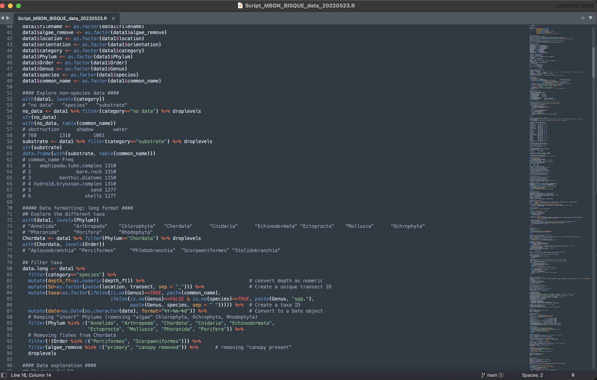
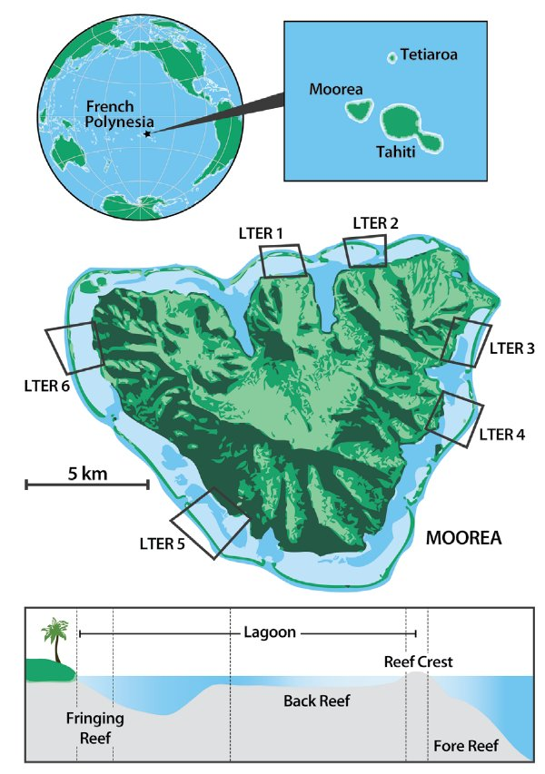
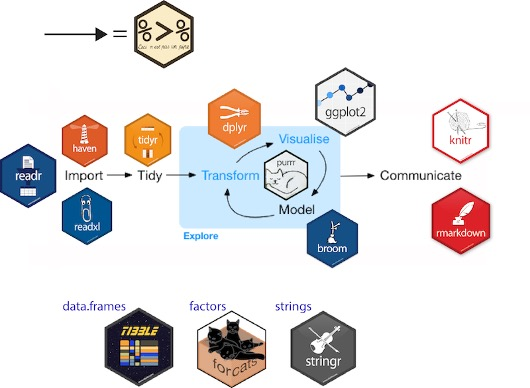

```{r setup, include=FALSE}
knitr::opts_chunk$set(echo=TRUE)
library(here)
library(knitr)
library(prettydoc)
```

**Les objectifs de cet atelier sont les suivants :**  

1) Comprendre et maitriser les bases et la syntaxe de R
2) Découvrir les classes d’objets et leur manipulation de base sous R
3) Maitriser la manipulation des données avancée à l'aide de packages spécifiques (e.g. tydiverse) 
4) Comprendre comment visualiser des données sous R 


# Les bases et la syntaxe de R

Voici une section d'un script R. Quels types d'éléments notez vous dedans ?

<p align="center">
  
</p>

Remarquez vous les **<-**, les **=**, les commentaires, l'opérateur **$** ou encore l'indentation et les espaces ? Ne nous laissez pas intimider par tout ce contenu nous allons décortiquer ces différents éléments !

## l'opérateur d'assignation (<-)

L'opérateur d'assignation dans R est le **<-**. Il affecte les valeurs de droite aux objets de gauche. Voici un exemple :
```{r}
x <- 7
```
La valeur de **x** est 7. La flèche peut être lue comme 7 va dans **x**. le symbole **=** peur également être utilisé pour les assignations, mais pas dans tous les contextes. Pour cela il est bon de toujours utiliser <- pour les assignations, sauf lorsqu'il s'agit de spécifier les valeurs des arguments dans les fonctions, où seul **=** doit être utilisé.

## Les commentaires (#)
Le symbole **#** est utilisé pour commenter. Tout ce qui se trouve à droite d'un **#** est ignoré par R, ce qui signifie qu'il ne sera pas exécuté. Les commentaires sont très importants afin de décrire le code pour soi même et pour ses collabateurs.
```{r}
# nous allons illustrer comment assigner la valeur 7 à l'objet x
x <- 7
```

## Les fonctions de base
Les fonctions sont des *scripts en boîte* qui automatisent quelque chose de compliqué ou de pratique, ou les deux. De nombreuses fonctions sont prédéfinies dans R. Une fonction reçoit généralement une ou plusieurs entrées appelées arguments. Un exemple simple de fonction est *sqrt()*. L'entrée (l'argument) est un nombre, et la valeur de sortie est la racine carrée de ce nombre. Voici un exemple d'appel de fonction :
```{r}
sqrt(7)
```
Ou, puisque nous avons déja un objet x composé le l'élément 7 :
```{r}
sqrt(x)
```

## Les arguments des fonctions
Les arguments peuvent être n'importe quoi, pas seulement des nombres ou des noms de fichiers, mais aussi d'autres objets. La signification exacte de chaque argument diffère selon la fonction, et doit être recherchée dans la documentation de la fonction. Certaines fonctions prennent des arguments qui peuvent être spécifiés par l'utilisateur. Les options des argurments d'une fonction sont généralement utilisées pour modifier la façon dont une fonction fonctionne sous R. Par exemple pour savoir si la fonction doit ignorer des valeurs manquates. Si aucune option n'est spécifiée pour un argument une valeur par défaut est sélectionnée.

Regardons avec une fonction simple qui peut prendre un argument en compte :
```{r}
log(10)
log(10, base=exp(1))
log(10, base=10)
```

## Rechercher de l'aide sur une fonction
Si vous désirez utiliser une fonction mais ne vous ne connaissez pa les arguments ou son fonctionnement exact, vous pouvez retrouver sa documentation en utilisant la formulation suivante :
```{r}
?log
```

## Les packages
R dispose de fonctions de base mais la très grande communauté scientifique de R développe constamment de nouvelles fonctions qui ne sont pas directement accessibles sous R. Il faut télécharger ces packages puis les charger dans sa session de R avant utilisation. 


# Les différentes classes d'objects et leur manipulation sous R Studio

R peut être simplement utilisé en tapant directement des formules mathématiques :
```{r}
7 * 3
```
Toutefois R devient intéressant lorsque nous attribuons des valeurs à des objets. Sous R différentes classes d'objets existent mais nous nous focaliserons ici sur 2 principales classes : les vecteurs et les data.frames


## Les élements simples
Nous avons vu précedemment comment créer des objects simples en tapant des objets numériques contenant une seule valeur. Ces objects peuvent être manipulés entre eux :
```{r}
poids <- 70
taille <- 1.75
```

<span style="color: red;"> **Défi : quel est l'indice de masse corporelle ?** </span> 

L'indice de Masse Corporelle (IMC), est calculé à partir de la taille et du poids selon la formule suivante :   
IMC = poids en kg/taille² (en m)  
Il permet d'évaluer le statut pondéral d'une personne. Selon l'OMS, un IMC normal doit se situer entre 18,5 à 24,9.

<details>
  <summary> **Solution du défi** </summary>
```{r}
poids/(taille^2)
```
Nous pouvons aussi assigner ce résultat à un nouvel object afin de l'enregistrer
```{r}
IMC1 <- poids/(taille^2)
```
</details>


## Les vecteurs

Un vecteur est un format de données courant et basique de R. Il s'agit d'un groupe de valeurs, principalement des nombres ou des caractères. Vous pouvez affecter cette liste de valeurs à une variable, tout comme vous le feriez pour un élément. Par exemple, nous pouvons créer un vecteur de poids et de taille :
```{r}
poids <- c(60, 65, 68, 70)
taille <- c(1.65, 1.71, 1.62, 1.75)
```

Un vecteur peut aussi contenir des caractères (i.e., texte). Voici un exemple :
```{r}
sexe <- c("femme", "femme", "homme", "homme")
```

<span style="color: red;"> **Défi : quel est l'indice de masse corporelle des 4 sujets ?** </span> 

Comme pour les éléments simples, nous pouvons réaliser des formules à partir et entre des vecteurs.

<details>
  <summary> **Solution du défi** </summary>
```{r}
IMC <- poids/(taille^2)
```
</details>  


Différentes fonctions vous permettent d'inspecter le contenu d'un vecteur. Par exemple *length()* vous indique combien d'éléments se trouvent dans un vecteur donné :   
```{r}
length(poids)
```  

<span style="color: red;"> **Défi : que fait la fonction class() ?** </span>  

explorer la fonction class()

<details>
  <summary> **Solution du défi** </summary>
```{r}
class(x)
class(poids)
class(sexe)
```
</details> 

Nous venons de voir 2 des 6 classes de vecteurs atomiques que R utilise : "character" et "numeric".  
Ce sont les blocs de construction de base à partir desquels tous les objets R sont construits.  
Il y a 4 autres classes que nous ne développerons pas ici : "logical" (VRAI et FAUX), "integer" (nombres entiers), "complex" et "bruts".


## Autres classes d'objects 
Les vecteurs sont l'une des nombreuses structures de données que R utilise. Les autres structures importantes sont les listes (list), les matrices (matrix), les jeux de données (data.frame), les tableaux (arrays) ou encore les facteurs (factor).   
Nous nous focaliserons ici sur les data.frames car il s'agit d'un des formats le plus classique pour stocker et gérer ses données.  
Par exemple, nous pouvons utiliser les vecteurs créés précédemment pour créer un jeu de données data.frame :

```{r}
data_IMC <- data.frame(sexe, poids, taille, IMC)
```

Les fonctions utiles pour explorer un data.frame sont les suivantes :

```{r}
dim(data_IMC)
ncol(data_IMC)
nrow(data_IMC)
str(data_IMC)
```

## Manipulations de base sur les vecteurs et les data.frames

### Extraction de valeurs spécifiques
Afin d'extraire une ou plusieurs valeurs d'un vecteur, nous devons fournir un ou plusieurs indices entre crochets :

```{r}
poids[2]
poids[1:3]
poids[c(1,2,4)]
```

De même pour extraire des lignes d'un data.frame :
```{r}
data_IMC[2,]
data_IMC[1:3,]
data_IMC[c(1,2,4),]
```

Pour sélectionner des colonnes différentes solutions existent :
```{r}
data_IMC[,2]
data_IMC$poids
```

### Extraction conditionnelles des données
Nous avons vu que selon l'OMS, un IMC normal doit se situer entre 18,5 à 24,9.

<span style="color: red;"> **Défi : créer une condition afin d'identifier les données en dehors de cet intervalle ?** </span> 

<details>
  <summary> **Solution du défi** </summary>
```{r}
IMC < 24.9 & IMC > 18.5 
condition <- IMC < 24.9 & IMC > 18.5 
IMC[condition]
```
</details> 

<span style="color: red;"> **Défi : sélectionner les IMC supérieurs à 24,9 dans le tableau de données ?** </span> 

<details>
  <summary> **Solution du défi** </summary>
```{r}
data_IMC[data_IMC$IMC > 24.9,]
```
</details> 


# Manipulation des données sous R

Nous allons voir les opérations simples et de base de manipulation des données sous R puis introduire le package **tydiverse** qui représente une solution idéale et puissante de manipulation des données.    


## Jeu de données test

### description générale
Le jeu de données à charger est issu de suivis à long terme des communautés de poissons des récifs coralliens de l'île de Moorea située en Polynésie française (voir **Figure 1** ci-dessous). Ces données font partie du programme de surveillance des poissons du récif corallien de Moorea (Moorea Coral Reef Long-term Ecological Research - MCR LTER) établi par la National Science Foundation en 2004 comme système modèle pour mieux comprendre les facteurs qui influencent la structure et le fonctionnement des systèmes coralliens. Les données originales sont disponibles sous la licence CC BY 4.0 sur le site web [MCR LTER](http://mcrlter.msi.ucsb.edu/cgi-bin/showDataset.cgi?docid=knb-lter-mcr.6&displaymodule=entity&entitytype=dataTable&entityindex=1). 

<p align="center">
  
</p>

**Figure 1.** Carte de l'île de Moorea avec les sites suivis (LTER 1 à 6) et illustration des 3 habitats étudiés. Le jeu de données test se focalise seulement sur les sites 1 et 5 et la pente externe (fore reef).  

**Reference**    
|     Brooks. Data of Moorea Coral Reef LTER. 2021. MCR LTER: Coral Reef: Long-term Population and Community Dynamics: Fishes, ongoing since 2005. knb-lter-mcr.6.59 doi:10.6073/pasta/8a60deeb7d7e9b1abbebd0af8c773321

**Dans le cadre de cet atelier nous nous facaliserons sur les données suivantes :**   
    1) le site LTER 1 et 5 sur la pente externe (*fore reef*), contenant chacun 5 transects permanents pour les suivis des poissons  
    2) les données entre 2010 et 2020

### Charger le jeu de données sous R !

notre jeu de données *MCR_data_intro_R.csv* est stocké dans le dossier **data**. Explorer la fonction *read.csv()* :  
```{r}
?read.csv
```

<span style="color: red;"> **Défi : charger les données sous R à l'aide de la fonction read.csv ?** </span> 

<details>
  <summary> **Solution du défi** </summary>
```{r}
MCR_data <- read.csv(here("data", "MCR_data_intro_R.csv"), header=TRUE)
```
</details>  


### Exploration du jeu de données

Les données sont maintenant chargées sous R dans l'objet MCR_data. Tout d'abord vérifions de quelle classe d'object il s'agit ?  

```{r}
class(MCR_data)
```

Il s'agit bien d'un data.frame. Maintenant que le jeu de données est chargé explorer le jeu de données. Avec tout jeu de données une des premières choses à faire est de regarder l'état général des données en utilisant les fonctions suivantes :  
```{r}
head(MCR_data)
dim(MCR_data)
str(MCR_data)
```

**Questions** Quelles sont les différentes colonnes dans **MCR_data** ? Combien de données sont disponibles ?  

Maintenant à vous d'explorer plus en détail. Voici quelques défis :  

1) Pouvez-vous retrouver le nombre d'années disponible dans le jeu de données ?
2) Pouvez-vous retrouver le nombre de sites et d'habitat ?
3) Convertir les sites en facteurs
4) Combien de taxa de poissons sont présents dans le jeu de données ?
5) Quels taxa sont observés en 2015 sur le site 1 ?  

<span style="color: red;"> **Défi 1 : retrouver le nombre d'années disponible dans le jeu de données ?** </span> 

<details>
  <summary> **Solution du défi 1** </summary>
Première solution :  
```{r}
unique(MCR_data$Year)
```  

Deuxième solution (afin de ne pas utiliser le **$**):  
```{r}
with(MCR_data, unique(Year))
```

</details>  


<span style="color: red;"> **Défi 2 : retrouver le nombre de sites et d'habitat ?** </span> 

<details>
  <summary> **Solution du défi 2** </summary>
Afin de connaitre les noms des sites et de l'habitat :    
```{r}
with(MCR_data, unique(Site))
with(MCR_data, unique(Habitat))
```

Si vous souhaitez seulement connaitre le nombre exact de site vous pouvez aussi utiliser le code suivant :  
```{r}
length(with(MCR_data, unique(Site)))
```  

Notez que les sites sont codés **1** et **2**, pouvez-vous trouver de quelle classe d'objet il s'agit ?  

```{r}
class(MCR_data$Site)
```  

Les sites sont ici codés comme des entiers (des chiffres). Pour toute analyse les sites doivent généralement être codé comme des facteurs.

</details>  


<span style="color: red;"> **Défi 3 : convertir les sites en facteurs** </span> 

<details>
  <summary> **Solution du défi 3** </summary>
```{r}
MCR_data$Site <- as.factor(MCR_data$Site)
```

Qu'est ce qui a changé ? 
```{r}
class(MCR_data$Site)
unique(MCR_data$Site)
```
</details>  

<span style="color: red;"> **Défi 4 : combien de taxa de poissons sont présents dans le jeu de données ?** </span> 

<details>
  <summary> **Solution du défi 4** </summary>
```{r}
with(MCR_data, length(unique(Taxonomy)))
with(MCR_data, length(unique(Family))) 
```
</details>   

<span style="color: red;"> **Défi 5 : quels taxa sont observés en 2015 sur le site 1 ?** </span> 

<details>
  <summary> **Solution du défi 4** </summary>
Il existe beaucoup de solutions pour ce défis, plus ou moins pratiques :
```{r}
data_site1_2015 <- MCR_data[MCR_data$Site=="1" & MCR_data$Year == 2015,]
```

Ou encore en utilisant la fonction *subset* :
```{r}
data_site1_2015 <- subset(MCR_data, Site=="1" & Year == 2015)
```

Vous pouvez remarquer que chaque site est suivis à l'aide de 5 transects indépendants. En inspectant le jeu de données, dans la console de R ou bien en naviguant dans le jeu de données via le panneau "environment" de R Studio nous pouvons facilement voir les espèces présentes. Toutefois, si nous voulons exactement le nombre d’espèces nous pouvons utiliser le code suivant ; 
```{r}
length(unique(data_site1_2015$Taxonomy))
```  

Et bien sur le code suivant permet d'obenir le nom des espèces observées :
```{r}
unique(data_site1_2015$Taxonomy)
```  
</details>


## Le package tidyverse

### Introduction générale à tydiverse

Dans la partie précédente nous avons vu des opérations de manipulation des données de base. Pour des opérations plus compliquées, par exemple pour obtenir des moyennes par espèce, ou même pour des opérations simples, le code peut rapidement dévenir lourd sous R. Toutefois le package **tydiverse** offre une solution idéal pour manipuler ses données efficacement et de manière simple sous R.  

Tidyverse est une collection de packages R conçus pour la science des données. Tous les packages partagent une philosophie de conception, une grammaire et des structures de données sous-jacentes.

<p align="center">
  
</p>

Normalement tidyverse doit être installé avant le cours à l'aide de la commande *install.packages("tidyverse")*.  
Pour charger tidyverse :
```{r, message=FALSE, warning=FALSE}
library(tidyverse)
```

Nous allons également utiliser le package reshape2 et here :
```{r, message=FALSE, warning=FALSE}
library(reshape2)
library(here)
```

### dplyer, package au centre de tydiverse

**dplyer** est le package de R (inclus dans **tydiverse**) qui rend la manipulation des données simple et éfficace sous R, même pour les opérations les plus compliquées. **dplyer** fournit des outils simples pour les tâches les plus courantes de manipulation de données. Il est nottament conçu pour travailler directement avec des *data.frame*. Il est issu du package **plyr** mais qui était trop lent. Au contraire,  **dplyer** est rapide est efficace car certains calculs sont portés sous C++.  

Ici nous allons explorer et utiliser certaines des fonctions les plus courantes de dplyr :  
  * select()  
  * filter()  
  * mutate()  
  * group_by()  
  * summarize()  
  
Par exemple, *select()* permet de sélectionner certaines colonnes spécifiques, tandis que *filter()* permet de choisir des lignes selon un critère donnée.  

Par exemple nous pouvons choisir seulement les données sur les 

```{r}
Test <- select(MCR_data, Site, Taxonomy)
```  

Ou bien sélectionner les données de 2015 sur le site 1 en suivant la même logique que la fonction *subset* :
```{r}
data_site1_2015 <- filter(MCR_data, Site=="1" & Year == 2015)
```  

Ici il s'agit encore d'opérations simple. Toutefois la force de dplyer vient du fait de pouvoir intégrer toutes les étapes de manipuation des données en une seule section de code grace à l'utilisation du **pipe**.  


#### Le *pipe* (%>%) vers une gestion intégrée de la manipulation des données

Avant d'analyser un jeu de données il faut généralement effectuer de nombreuses opérations sur le jeu de données de base. Vous pouvez effectuer ces opérations une à une à l'aide d'étapes intermédiaires. Pour ce faire vous créez des data.frames les uns après les autres, chaque data.frame étant utilisé comme entrée pour la fonction suivante. Mais cela peut encombrer l'espace de travail avec de nombreux objets et n'est pas efficace.  

Le pipe, **%>%** est une nouveauté de R. Le pipe ermet de prendre la sortie d'une fonction et de l'envoyer directement à la suivante, ce qui est utile lorsque vous devez faire plusieurs choses sur le même ensemble de données. Les pipes sont disponibles via le package **magrittr** installé dans le cadre de **dplyr** et **tydiverse**.

Reprenons notre exemple précédent mais intégration les 2 étapes en une seule grâce au Le pipe, **%>%** :

```{r}
test <- MCR_data %>%
  filter(Site=="1" & Year == 2015) %>%
  select(Site, Taxonomy)
```  

Regardez votre nouveau jeu de données **test** ? Que remarquez vous si vous faite
```{r}
str(test)
```

Pourquoi le data.frame **test** garde l'information sur le site 5 ?  

Afin de remédier à cela nous pouvons utiliser la commande suivante :
```{r}
test <- MCR_data %>%
  filter(Site=="1" & Year == 2015) %>%
  select(Site, Taxonomy) %>%
  droplevels()
```  

Remarquez-vous la différence ? 

#### Autre fonctions importante de de dplyer

1) Il est fréquent de vouloir créer de nouvelles colonnes à partir des colonnes existantes, par exemple pour effectuer des conversions d'unités ou trouver le rapport entre les valeurs de deux colonnes. Pour cela, nous utiliserons *mutate()*.  

Dans le cas du data.frame **MCR_data** nous avons une colonne **Biomass** en Kg. Convertissons là en grammes.
```{r}
test <- MCR_data %>%
  mutate(Biomass_g = Biomass*1000)
```  
  
2) Remarquez que nous avons créé une nouvelle colonne **Biomass_g**. Pour être consistant dans les noms des colonnes nous pouvons renommer nos colonnes avec *rename*.
```{r}
test <- test %>%
  rename(Biomass_Kg = Biomass)
```  

rename(Nouveau Nom = Ancien Nom).


3) Très souvent, il faut diviser les données en groupes donnés puis appliquer une analyse à chaque groupe (par exemple trouver la moyenne d'une valeur), puis combiner les résultats entre eux. **dplyr** rend cela très facile grâce à l'utilisation des *group_by()*, *summarize()*.  

*group_by()* prend comme argument le(s) nom(s) de colonnes qui contiennent les variables catégoriques pour lesquelles vous voulez calculer une ou des statistiques. Ici nous pouvons regarder le nombre total d'individus de poissons rencontrés dans chaque site.

```{r, message=FALSE, warning=FALSE}
test <- MCR_data %>%
  group_by(Site) %>%
  summarize(sum_count=sum(Count, na.rm=TRUE))
```  

Notez que nous pouvons réaliser plusieurs opérations statistiques en même temps. Par exemple, calculons à la fois le nombre total de poissons rencontrés par site ainsi que la moyenne (par ligne) :

```{r, message=FALSE, warning=FALSE}
test <- MCR_data %>%
  group_by(Site) %>%
  summarize(sum_count=sum(Count, na.rm=TRUE), mean_count=mean(Count, na.rm=TRUE))
```  

Nous pouvons grouper les données par plusieurs colonnes. Ici calculons le nombre total de poissons observés pour chaque site et transect par site (note : il y a 4 transects suivis sur chaque site)

```{r, message=FALSE, warning=FALSE}
test <- MCR_data %>%
  group_by(Site, Transect) %>%
  summarize(sum_count=sum(Count, na.rm=TRUE))
```  

Cette étape est importante car nous pouvons ainsi créer des étapes intermédaires lorsque les données sont structurées (ici 4 transects / site) et obtenir des moyennes par groupe. Par exemple, calculons le nombre moyen de poissons osbervés par transect dans chacun des sites.  

```{r, message=FALSE, warning=FALSE}
test_mean <- MCR_data %>%
  group_by(Site, Transect) %>%
  summarize(sum_count=sum(Count, na.rm=TRUE)) %>%
  group_by(Site) %>%
  summarize(mean_count=mean(sum_count))
```  

Ce qui est équivalent à :  
```{r}
tapply(test$sum_count, test$Site, mean)
```  
  
  
### Défis !

#### Défi 1: trouvez les 10 espèces de poissons les plus abondantes à travsers tout le jeu de données ?
    
En utilisation **tydiverse** et **dplyer** pouvez-vous créer une table contant l'abondance relative des espèces, puis de sélectionner seulement les 10 espèces les plus abondantes ? Indices :  
1) Calculer le nombre total d'individus observés pour chaque espèce pour l'ensemble des années et des sites
2) Calculer l'abondance relative des espèces
3) Filtrer pour ne garder que les 10 10 espèces de poissons les plus abondantes ?

<span style="color: red;"> **Défi 1: les 10 espèces les plus abondantes !** </span> 

<details>
  <summary> **Solution du défi 1** </summary>

```{r, message=FALSE, warning=FALSE}
Taxa_list <- MCR_data %>%
  group_by(Taxonomy, Family, Fine_Trophic) %>%
  summarize(Count_tot=sum(Count, na.rm=TRUE)) %>%
  mutate(GENUS=sub(" .*", "", Taxonomy), 
         SPECIES=sub("^\\S* ", "", Taxonomy)) %>%
  ungroup() %>% mutate(Count_rel=Count_tot/sum(Count_tot, na.rm=TRUE) * 100) %>%
  arrange(desc(Count_rel))
```  
Voici le code avec ddplyer pour obtenir la liste des taxas, du plus abondant au moins abondant. Enfin, pour selectionner seulement les 10 premières espèces nous pouvons faire :  

```{r, message=FALSE, warning=FALSE}
Taxa_top10 <- Taxa_list %>%
  top_n(10, Count_rel)
```

Ce qui est similaire à :
```{r, message=FALSE, warning=FALSE}
Taxa_list[1:10,]
```
</details>  


#### Défi 2: filtrer et nettoyer des données !

**filtrez et nettoyez** les données comme suit :  
* utiliser uniquement les données de 2012 à 2020
* sélectionner seulement les familles Gobiidae, Labridae et Blenniidae 
* créer un nouveau nom de variable incluant à la fois l'habitat et site (i.e., FO_1)
* Renommer l'habitat en utilisant les noms complets (ici forereef)
* Renommer la colonne "Taxonomy" en "Species_name".

<span style="color: red;"> **Défi 2 : filtrer et nettoyer des données !** </span> 

<details>
  <summary> **Solution du défi 2** </summary>

```{r, message=FALSE, warning=FALSE}
MCR_data_filtered <- MCR_data %>%
  filter(Year %in% c(2012:2020)) %>% 
  filter(Family %in% c("Gobiidae", "Labridae", "Blenniidae")) %>%
  mutate(Site2=paste(Habitat, Site, sep="_")) %>%  
  mutate(Habitat=recode_factor(Habitat, FO="Forereef")) %>%
  rename(Species_name=Taxonomy) %>%
  ungroup() %>% droplevels
```
</details>  

#### Défi 3: aggreger et résumer les données !
 
**3a: résumer les données au au niveau des transects**

Agrégez le nombre de poissons et la biomasse au niveau du transect. Pour ce faire, nous allons additionner le nombre de poissons et la biomasse à travers les sous-échantillons (2 *swaths* et différentes classes de taille par transect). Le but est d'obtenir un nouveau data.frame avec le nombre total d'individus et leur biomasse observés sur chaque transect et pour chaque année.

<span style="color: red;"> **Défi 3: aggreger et résumer les données !** </span> 

<details>
  <summary> **Solution du défi 3** </summary>

```{r, message=FALSE, warning=FALSE}
MCR_data_transect <- MCR_data_filtered %>%
  group_by(Year, Habitat, Site, Transect) %>%
  summarize(Count=sum(Count), Biomass=sum(Biomass)) %>%
  ungroup() %>% droplevels
```
</details>  

## Croiser des données avec *join* et *dplyer*

### left_join(x, y)

Un *left join* signifie d'inclure toute les données de la partie GAUCHE (ce qui est dans le data.frame x) et d'y ajouter les les lignes correspondantes de la partie DROITE (dans le data.frame y). Si des lignes sont uniquement présentent dans la partie DROITE (y), elles ne seront pas conservées.  

Pour comprendre cela nous allons fabriquer deux data.frames **x** et **y** très simples à partir de nos données tests **MCR_data**.

**x** contient des données sur le nombre total d'individus de poissons sur les 2 sites entre 2015 et 2020
```{r, message=FALSE, warning=FALSE}
x <- MCR_data %>%
  filter(Year %in% c(2015:2020)) %>% 
  group_by(Year, Site) %>%
  summarize(Count=sum(Count))
```  
  
**y** contient des données sur la visibilité moyenne sur les 2 sites entre 2010 et 2019
```{r, message=FALSE, warning=FALSE}
y <- MCR_data %>%
  filter(Year %in% c(2012:2019)) %>% 
  group_by(Year, Site) %>%
  summarize(Visibility=mean(Visibility, na.rm=TRUE))
```
  
Combien de lignes contiennent **x** et de **y** ?

```{r, message=FALSE, warning=FALSE}
xy <- x %>%
  left_join(y, by=c("Year", "Site"))
```  

Que notez vous pour l'année 2020 ?

### inner_joint(x, y)

Avec *inner joint* nous pouvons sélectionner les lignes qui sont commune à *x* et *y*. Dans notre cas cela permet de sélectionner les données qui ont à la fois des données de *Count* et des données dans *Visibility*.

```{r, message=FALSE, warning=FALSE}
xy <- x %>%
  inner_join(y, by=c("Year", "Site"))
```
Remarque vous la différence ?

### full_join(x, y)

Avec *full joint* nous pouvons garder l'ensemble des lignes dans *x* et *y* même celles qui sont uniques à *x* ou *y*.  

```{r, message=FALSE, warning=FALSE}
xy <- x %>%
  full_join(y, by=c("Year", "Site"))
``` 

## Format *long* et format *wide* des données

Toutes les données précédentes sont en format *long*, c'est à dire que chaque information est stockée dans une ligne unique. Parfois il peut être utile d'utiliser des formats *wide*, nottament car certaines fonctions sous R utilisent ce format là. C'est par exemple le cas de **packages** d'écologie des communautés qui acceptent comme object une matrice de sites (en lignes) x espèces (en colonne). Comment pouvons nous passer du format **long** au format **wide** ?  

Par exemple reprenons le jeu de données **MCR_data_filtered**. Nous allons résumer les donnée pour la colonne "Coarse_Trophic", en faisant la somme des comptages à travers les à travers les sous-échantillons (2 *swaths* et différentes classes de taille par transect).
Groupons les donnée   

```{r}
MCR_data_transect_trophic <- MCR_data_filtered %>%
  group_by(Year, Habitat, Site, Transect, Coarse_Trophic) %>%
  filter(Coarse_Trophic!="na") %>%
  summarize(Count=sum(Count)) %>%
  ungroup() %>% droplevels
```

Maintenant regardons comment utiliser la fonction *dcast* du package **reshape2** :  
```{r}
MCR_data_transect_trophic_wide <- dcast(MCR_data_transect_trophic, Year + Site + Transect ~ Coarse_Trophic, value.var="Count", na.rm=)
```

Par défaut le jeu de données test en format *long* n'était pas *zero-filled* ()
By default the long-data format was not zero-filled ((lorsqu'une espèce n'a pas été observée, elle ne figure pas dans l'ensemble de données), ce qui crée de nombreux NA au lieu de 0 dans le format de données *wide*. Nous pouvons changer cela manuellement :  
```{r}
MCR_data_transect_trophic_wide[is.na(MCR_data_transect_trophic_wide)] <- 0
```

Enfin, l'inverse de *dcast* est *melt* afin de passer d'un format *wide* à un format *long*.


# Représenter des données sous R

Représenter des données, ou les résultats d'une analyse est l'une des étapes les plus importantes. **R** offre de nombreuses solutions afin de réaliser des figures de très haute qualité. Nous allons discuter des différentes options disponibles sous **R** et nous nous focaliserons en particulier sur le package **ggplot2**.  

Nous avons déja un jeu de données test, **MCR_data**, que nous avons manipulé et aggrégé sous la forme des différents jeu de données suivant :  
* **MCR_data_transect_Trophic**
* **Taxa_list**  
* **MCR_data_transect_trophic** 

Nous allons utiliser ces données afin de créer des figures sous **R**.


## Comment faire un graphique avec les fonctions de base sous R ?

**R** offre des fonctions de base afin de créer des figures simples ou avancées. Par exemple, nous pouvons représenter le nombre de poissons observés par année avec la fonction de base *plot()* :

```{r}
plot(MCR_data_transect_trophic$Year, MCR_data_transect_trophic$Count)
```  

Ou encore nous pouvons construire l'histogramme de l'abondance relative des espèces avec la fonction de base *hist()* :

```{r}
hist(Taxa_list$Count_rel)
```   

**Avantages** : très simple ! Pas besoin de charger des packages.  
**Problèmes** : options limitées et ne produit pas les figures les plus avancées ni les plus belles.  

Avec les fonctions graphiques de base nous pouvons toujours modifier différents aspects de la figure avec des options, comme le nom des axes, le titre, la taille du texte, la position des axes, etc.  

Par exemple nous pouvons modifier notre histogramme en utilisant différents arguments dans la fonction *hist()*. A vous de jouer ! Regardez comment *hist()* fonctionne avec la fonction aide que nous avons vu en introduction.

```{r}
?hist()
```   

<span style="color: red;"> **Défi : éditer votre histogramme pour modifier les noms des axes et la couleur** </span> 

<details>
  <summary> **Solution du défi** </summary>

```{r, message=FALSE, warning=FALSE}
hist(Taxa_list$Count_rel, xlab="Abondance relative", ylab="Frequence", col="steelblue2", border="black", main="Mon nouveau titre", nclass=100)
```   
</details>

Au final, utiliser les fonctions graphiques de base offre une solution simple et rapide qui peut être bien afin d'explorer graphiquement des données. Toutefois, le package **ggplot2** s'impose maintenant comme la référence afin de faire des graphiques sous **R**. 

## Les graphiques avec **ggplot2**

Le package **ggplot2** devrait déja être installé. Avant de pouvoir l'utiliser n'oubliez pas de le charger sous **R** :  
```{r}
library(ggplot2)
```   


### Qu'est ce que ggplot2 ?

Le package **ggplot2** est très puissant pour réaliser des graphiques. Toutefois sa structure générale est assez différente des fonctions de base sous R et requiert une certaine habitude. Généralement, **ggplot2** s'utilise en fournissant ces différentes informations :  
* **Nom de la figure** que nous allons créer. La figure devient alors un objet **R** de la classe ggplot;  
* **nom du jeu de données** à partir duquel sera réalisée la figure;  
* **nom des axes** des x et des y (voir plus si différentes facettes dans la figure);  
* **fonction spécifique de ggplot** afin d'indiquer à ggplot le type de graphique désiré : des points, des lignes, des histogrammes, etc. ?  

En prenant notre jeu de données **Taxa_list** voyons comment nous pouvons reproduire un histogramme sous **ggplot2**  :
```{r}
pp <- ggplot(data=Taxa_list, aes(x=Count_rel)) +
  geom_histogram()
```  

Pour représenter votre graphique vous pouvez tapez **pp** et entrer. Voici la version la plus basique d'un graphique sous **gpplot2**. Que remarquez-vous ? L'avantage et que tous les aspects graphiques peuvent être modifiés. Nous allons voir quelques modifications de base qui peuvent rendre les graphiques plus lisibles.

### Modifier les figures sous ggplot2 et les différents thèmes

#### Les arguments des différentes fonctions de ggplot2 : illustration   
  
Changer la largeur et la couleur des barres :
```{r, message=FALSE, warning=FALSE}
ggplot(data=Taxa_list, aes(x=Count_rel)) +
  geom_histogram(binwidth=0.25, color="black", fill="steelblue2")
```
  
Changer les noms des axes et le titre de la figure :  
```{r, message=FALSE, warning=FALSE}
pp <- ggplot(data=Taxa_list, aes(x=Count_rel)) +
  geom_histogram(binwidth=0.25, color="black", fill="steelblue2") +
  labs(title="Mon histogramme sous ggplot",x="Abondance relative", y = "Count")
pp
```  
  
  

#### Changer le thème général des figures sous ggplot2

**ggplot2** contient des thèmes prédéfinis. Le thème de base de **ggplot2** est *theme_grey()*, c'est celui que nous voyons sur les figures précédentes. Il s'agit d'un fond gris clair et d'une grille blanche. Ce thème est conçu pour mettre les données en avant et faciliter les comparaisons et le jugement sur la position des données.

Il existe toutefois sept autres thèmes prédéfinis :  
* *theme_bw()* : une variation de *theme_grey()* qui utilise un fond blanc et de fines lignes de grille grises.  
* *theme_linedraw()* : un thème avec uniquement des lignes noires de différentes largeurs sur des fonds blancs, rappelant un dessin au trait.  
* *theme_light()* : similaire à *theme_linedraw()* mais avec des lignes et des axes gris clair, pour diriger davantage l'attention vers les données.
* *theme_dark()* : le cousin sombre de *theme_light()*, avec des lignes de taille similaire mais un fond sombre. Utile pour faire ressortir les lignes fines et colorées.  
* *theme_minimal()* : un thème minimaliste sans annotations de fond.  
* *theme_classic()* : un thème d'apparence classique, avec des lignes d'axe x et y et sans lignes de grille.  
* *theme_void()* : un thème complètement vide.

<span style="color: red;"> **Défi : explorer ces thèmes prédéfinis pour modifier la figure pp** </span> 

<details>
  <summary> **Solution du défi** </summary>

Exemple avec deux thèmes :  
```{r, message=FALSE, warning=FALSE}
pp  + theme_classic()
```

Ou encore :  
```{r, message=FALSE, warning=FALSE}
pp  + theme_bw()
```
</details>  
  
  

Le thème peut toutefois être complétement changé *à la main* en spécificant les configurations désirées. Cela est nottament important afin de changer des figures finales. Par exemple lorsque le titre ou les axes des x et des y sont trop petits. Il permet aussi de changer la couleur des axes. **Tout est modifiable !** Par ailleurs les thèmes prédéfinis peuvent aussi être modifiés en combinant le thème prédéfini désiré puis en changeant certains aspects avec la fonction *theme()*. Voyons comment créer son propore thème sous **ggplot2**.  

Dans l'exemple ci-dessous je vais :  
1) agrandir mon titre  
2) agrandir le texte des axes des x et des y  
3) définir un fond gris et une grille principale  
4) supprimer la grille secondaire de base sous **ggplot2**  


```{r, message=FALSE, warning=FALSE}
gg_theme <- theme(plot.title=element_text(face="bold", size=20),
                axis.text=element_text(size=16),
                axis.ticks=element_line(colour="grey70", size=0.2),
                panel.grid.major=element_line(colour="grey70", size=0.2),
                panel.grid.minor= element_blank())
pp  + gg_theme
```

Je peux aussi changer seulement la taille du titre et du texte des axes en me basant sur un thème prédéfini :  

```{r, message=FALSE, warning=FALSE}
pp  + theme_classic() +
  theme(plot.title=element_text(face="bold", size=20),
                axis.text=element_text(size=16))
```

### Vers des figures plus avancées : histogramme de l'abondance relative des espèces avec avec geom_bar()

Repartons de notre liste **Taxa_list**. Nous voulons ici refaire un histogramme avec l'abondance relative des espèces en y et les espèces sur l'axe des x, classées de la plus abondante à la moins abondante.  
  
```{r, fig.align="center"}
ggplot(Taxa_list, aes(x=reorder(Taxonomy, -Count_rel), y=Count_rel)) + 
  geom_bar(position="dodge", stat="identity", fill="steelblue2", colour="grey") + 
  xlab("Taxa") + ylab("Abondance relative") +
  theme_bw()
```


La distribution des espèces est extrêmement inégale et il y a une très longue queue d'espèces rares. L'histogramme est difficile à lire tel quel. Essayons de nous concentrer uniquement sur les espèces dont l'abondance relative est supérieure à 0,5% pour produire un histogramme plus clair.  

```{r, fig.align="center"}
# Filtre des données
Taxa_list_0.5 <- Taxa_list %>% filter(Count_rel > 0.5)

# Figure
pp <- ggplot(Taxa_list_0.5, aes(x=reorder(Taxonomy, -Count_rel), y=Count_rel)) + 
  geom_bar(position="dodge", stat="identity", fill="steelblue2", colour="grey") + 
  xlab("Taxa") + ylab("Relative abundance") +
  theme_bw() +
  theme(axis.text=element_text(size=8),
        axis.text.x=element_text(angle=90, hjust=1),
        axis.title=element_text(size=16, face="bold"),
        axis.line = element_line(colour = "black"))
pp
```

Nous pouvons aussi jouer avec l'option *coord_flip()* pour changer la direction de la figure.
```{r, fig.align="center"}
 pp + coord_flip()
```  


Enfin, pour personnaliser l'histogramme, nous pouvons colorer les espèces en fonction des groupes trophiques.

```{r, fig.align="center"}
pp <- ggplot(Taxa_list_0.5, aes(x=reorder(Taxonomy, -Count_rel), y=Count_rel, fill=Fine_Trophic)) + 
  geom_bar(position="dodge", stat="identity", colour="grey") + 
  xlab("Taxa") + ylab("Relative abundance") +
  theme_bw() +
  theme(axis.text=element_text(size=8),
        axis.text.x=element_text(angle=90, hjust=1),
        axis.title=element_text(size=16, face="bold"),
        axis.line=element_line(colour = "black"))
```

Vous notez que cela introduit une légende. Comme tous les éléments de **ggplot** la légende peut-être modifiée : sa taille, son fond, son titre, sa position, *etc*. Ici nous pouvons déplacer la légende dans la partie inférieure de la figure comme ceci :

```{r, fig.align="center"}
pp + theme(legend.position="bottom")
```

### Figures sur plusieurs panneaux en fonction de variables dans le jeu de données

Nous allons représenter la dynamique de l'abondance des poissons observés entre 2012 et 2020 sur les sites 1 et 5. Pour cela nous allons utiliser les fonctions *geom_point()* et *geom_line()*. Utilisons d'abord *geom_point()* afin de voir la distribution des données entre 2012 et 2020 au niveau des 2 sites (similaire à la figure réalisée avec la fonction de base *plot()*) :    

```{r, fig.align="center"}
ggplot(MCR_data_transect_trophic, aes(x=Year, y=Count)) +
  geom_point(aes(color=Site)) +
  xlab("Année") + ylab("Nombre de poissons") +
  theme_bw() +
  theme(axis.title=element_text(size=12), axis.text=element_text(size=12),
  legend.position="bottom")
```  

**Que représente un point ici ?**  

Il s'agit de l'abondance d'un groupe trophique sur l'un des 4 transects de chaque site !  

Nous avons deux variables qui se confondent dans cette figure. Nous pouvons les faire ressortir en créant des sous-figures pour chaque combinaison des différentes variables (par ex. *planktivores* x transect 1). Pour cela nous pouvons utiliser la fonction *facet_grid()*. Nous allons aussi créer des courbes avec la fonction *geom_line()* :  


```{r, fig.align="center"}
ggplot(MCR_data_transect_trophic, aes(x=Year, y=Count)) +
  geom_point(aes(color=Site)) +
  geom_line(aes(color=Site)) +
  facet_grid(Transect~Coarse_Trophic) +
  xlab("Année") + ylab("Nombre de poissons") +
  theme_bw() +
  theme(axis.title=element_text(size=12), axis.text=element_text(size=12),
  legend.position="bottom")
```


### Résumer les données pour réaliser des figures plus synthétiques 

Nous voyons dans la figure précédente que les transects sont des réplicats afin de comprendre l'abondance des poissons. La figure précédente contient 16 sous-figures. Nous pouvons faire des moyennes à travers les différents transects afin de synthétiser les données.    

Nous allons utiliser le package **dplyer** afin de résumer les données au niveau des transects (dans les données **MCR_data_transect_trophic**) pour obtenir l'abondance moyenne par site et par groupe trophique et l'intervalle de confiance autour de cette moyenne. 

**Rappel** : l'intervalle de confiance pour une distribution normale :  
$$
CI = moyenne +/- 1.96*SE
$$
avec :  
$$
SE = SD / sqrt(N)
$$


<span style="color: red;"> **Défi : calculer l'abondance moyenne par site et par groupe trophique ainsi que l'intervalle de confiance** </span> 

<details>
  <summary> **Solution du défi** </summary>

```{r, message=FALSE, warning=FALSE}
MCR_data_site_trophic <- MCR_data_transect_trophic %>%
  group_by(Year, Site, Coarse_Trophic) %>%
  summarize(Count_mean=mean(Count, na.rm=TRUE), Count_sd=sd(Count, na.rm=TRUE), Count_n=n()) %>%
  mutate(Count_se=Count_sd/sqrt(Count_n),
         CI_lw=Count_mean - qnorm(0.975) * Count_se,
         CI_up=Count_mean + qnorm(0.975) * Count_se) %>%
         # CI_lw=Count_mean-qt(1 - (0.05 / 2), n.mpg - 1)*Count_se,  POUR UNE DISTRIBUTION t
         # CI_up=Count_mean+qt(1 - (0.05 / 2), n.mpg - 1)*Count_se) 
  ungroup() %>% droplevels
```

</details>  

Maintenant que nous avons calculé la moyenne et l'intervalle de confiance nous pouvons représenter les données.  

<span style="color: red;"> **Défi : faire une figure pour illustrer la moyenne et l'intervalle de confiance** </span> 

<details>
  <summary> **Solution du défi** </summary>


```{r, fig.align="center"}
ggplot(MCR_data_site_trophic, aes(x=Year, y=Count_mean, color=Site)) +
  geom_errorbar(aes(ymin=CI_lw, ymax=CI_up), width=0.1) +
  geom_point() +
  geom_line() +
  facet_grid(~Coarse_Trophic) +
  xlab("Année") + ylab("Nombre de poissons") +
  theme_bw() +
  theme(axis.title=element_text(size=12), axis.text=element_text(size=12),
  legend.position="bottom")
```

Ajoutez *colour="black"* dans la fonction *geom_errorbar*, que se passe-t-il ?   

</details>  

### Ajouter une tendance sur les données


```{r, message=FALSE, warning=FALSE, fig.align="center"}
ggplot(MCR_data_transect_trophic, aes(x=Year, y=Count, color=Site)) +
  geom_point() +
  facet_grid(~Coarse_Trophic) +
  geom_smooth(method="loess", se=FALSE) +
  xlab("Année") + ylab("Nombre de poissons") +
  theme_bw() +
  theme(axis.title=element_text(size=12), axis.text=element_text(size=12),
  legend.position="bottom")
```


# Références et liens pour approfondir le cours

Les *cheatsheets* contenant les informations résumées des différents packages :
* pour [**dplyer**](https://www.rstudio.com/wp-content/uploads/2015/02/data-wrangling-cheatsheet.pdf)  
* pour [**ggplot2**](https://github.com/rstudio/cheatsheets/blob/main/data-visualization.pdf)  

Note : l'ensemble des [*cheatsheets*](*cheatsheets*) disponibles pour les packages les plus populaires de R.
    
Cours disponibles en français : je recommande grandement les [Ateliers R du CSBQ](https://wiki.qcbs.ca/r#ateliers_r_du_csbq_qcbs_r_workshops) (Centre de la science de la biodiversité du Québec).


